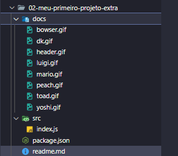

# 🏎️ Projeto Mario Kart.JS — Bootcamp Node.js DIO

Este repositório contém o desafio prático do Bootcamp **Node.js** da [Digital Innovation One (DIO)](https://www.dio.me/), onde aplicamos conceitos de lógica de programação para simular corridas entre personagens do universo Mario Kart.  
O projeto utiliza **JavaScript**, executado com **Node.js**, e está organizado com boas práticas de estruturação de arquivos.

---

## 🎯 Objetivo

Simular uma corrida de Mario Kart utilizando lógica de programação. A corrida ocorre entre dois personagens escolhidos aleatoriamente, com base em atributos como **velocidade**, **manobrabilidade** e **poder**, e com variações de pista a cada rodada.

---

## 👾 Personagens Disponíveis

| Personagem | Imagem | Velocidade | Manobrabilidade | Poder |
|------------|--------|------------|------------------|-------|
| Mario |  | 4 | 3 | 3 |
| Peach |  | 3 | 4 | 2 |
| Yoshi |  | 2 | 4 | 3 |
| Bowser |  | 5 | 2 | 5 |
| Luigi |  | 3 | 4 | 4 |
| Donkey Kong |  | 2 | 2 | 5 |
| Toad |  | 4 | 5 | 1 |

---

## ⚙️ Regras & Mecânicas

### 🎮 Jogadores

- O sistema sorteia **dois personagens** automaticamente para disputar a corrida.
- Cada personagem é representado por um **objeto** com seus atributos.

### 🛣️ Pista

- A corrida ocorre em uma **pista com 5 rodadas**.
- A cada rodada, o sistema sorteia um dos três tipos de **bloco de pista**:
  - **Reta**: soma da **velocidade** + dado (D6). Ganha 1 ponto.
  - **Curva**: soma da **manobrabilidade** + dado (D6). Ganha 1 ponto.
  - **Confronto**: soma do **poder** + dado (D6). Quem perder, perde 1 ponto.
- Nenhum jogador pode ter pontuação negativa.

### 🏁 Vitória

- Ao final das 5 rodadas, vence o jogador com mais pontos.

---

## 📁 Estrutura do Projeto




---

## 🧩 Extras Implementados

Durante o desenvolvimento, foram adicionadas melhorias além do escopo original proposto no desafio:

Implementação das melhorias no confronto:

- [x] **Perder 1 ponto com casco ou 2 com bomba (aleatório).**
- [x] **Quem vencer o confronto pode ganhar 1 ponto extra com turbo (também aleatório).**


Essas adições tornaram o projeto mais completo, divertido e alinhado com boas práticas de desenvolvimento com Node.js.


## 🚀 Como executar o projeto

1. Clone o repositório:
   ```bash
   git clone https://github.com/seu-usuario/dio.node-js.git
   cd dio.node-js
